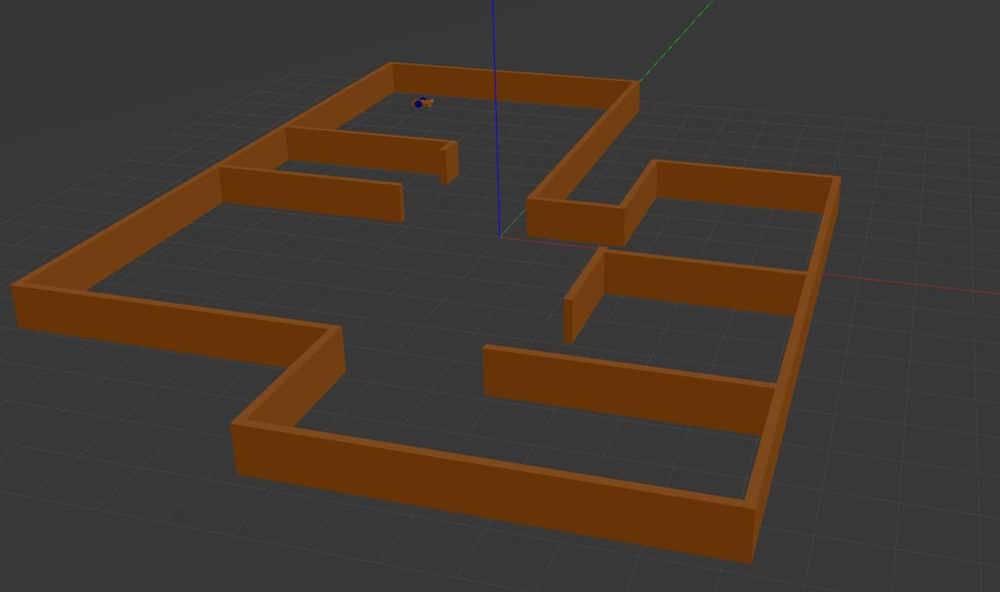
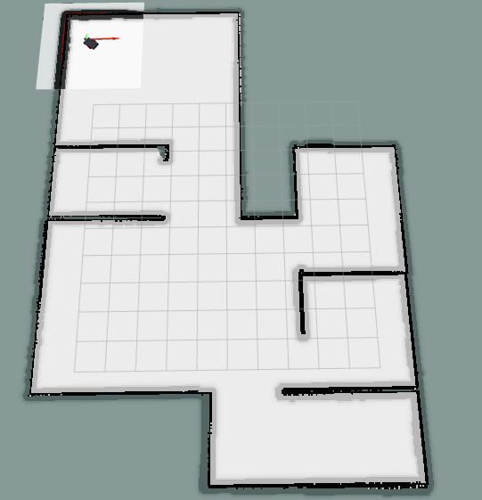

# Assignment 3: ROS Mobile Robots Simulator

Developer: Thomas Campagnolo (S5343274)

MSc Robotics Engineering, University of Genova.

For the first assignment of the **Research Track 2 course**, the project of the third and final assignment of the Research Track I course is integrated with:
*  Sphinx documentation of the entire project, visible at the following link [Assignment 3 Documentation](https://thomascampagnolo97.github.io/final_assignment/)
*  Jupyter notebook to interact with the simulation, in particular:
    * Switch between the different modalities, and manage them;
    * Plot the robot position (x- y- coordinates), the laser scanner data and the goal reached/unreached.
    
More details are written in the [jupyter notebook](https://github.com/thomascampagnolo97/final_assignment/blob/rt2_assignments/jupyter_notebook/UI_controller_data_visualizer.ipynb).

The simulation involves a mobile robot positioned inside an environment, and it's equipped with a laser scanner in order to detect the presence of obstacles, such as the walls of the environment. 
The aim of the project is to develop an architecture to control the robot in the environment. The software will rely on the `move_base` and `gmapping` packages for localizing the robot and plan the motion. The implemented architecture allows the user to perform three different robot behavior modes, in particular:
* Reach autonomously the coordinate (x, y) entered by the user, thus obtaining an autonomous guide of the robot; 
* Let the user to drive the robot with the keyboard, thus having the opportunity to try a manual robot driving experience; 
* Let the user to guide the robot with the keyboard with assistance to avoid collisions with obstacles.

The project is developed in ROS and Python.

## Installing and clone

The simulator requires the version of [ROS Noetic](http://wiki.ros.org/noetic/Installation) and the following packages if they are not already installed:

* ros navigation stack:
```
sudo apt-get install ros-noetic-navigation
```

Furthermore, is necessary to clone the following GitHub repositories into the src directory of your ROS workspace:
```
git clone https://github.com/CarmineD8/slam_gmapping.git
```
remember to switch on the branch `noetic` using: `git checkout noetic`, and
```
git clone https://github.com/thomascampagnolo97/final_assignment.git
```
remember to switch on the branch `rt2_assignments` using: `git checkout rt2_assignments`.

After you have cloned this packages, you need to build your workspace with `catkin_make` and update it with `rospack profile` (remember to go to the root directory of the workspace before running the commands).

## How to run

When you have download and build the workspace, make sure that all the `.py ` files in the scripts folder are executables, otherwise you can make it with: 
```
chmod +x <name_file_python.py>
```
Now you can run the simulation, using the following commands in two separate terminals.

* Run the robotic simulation on Gazebo and Rviz:
```
roslaunch final_assignment simulation.launch
```
* Run the rt2_assignment launch file:
```
roslaunch final_assignment rt2_assignment.launch
```
Once the three commands have been launched in the terminals you can run the notebook [GUI notebook](https://github.com/thomascampagnolo97/final_assignment/blob/rt2_assignments/jupyter_notebook/UI_controller_data_visualizer.ipynb).

The simulation in the Gazebo and Rviz environment looks like this:




## Possible improvements

Some of the possible improvements can be: 
* give the user the possibility to cancel the target goal while the robot is moving;
* make the robot move in the environment at the first start in order to save the complete map so as to know in advance if the goal coordinates are reachable or not.
